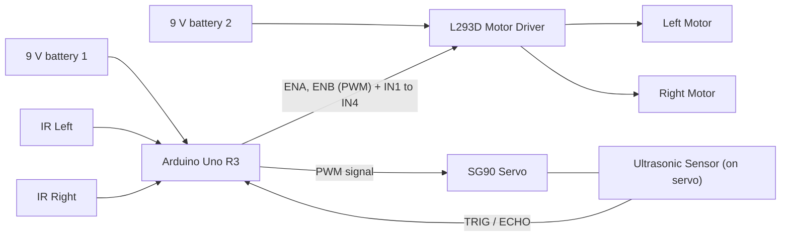
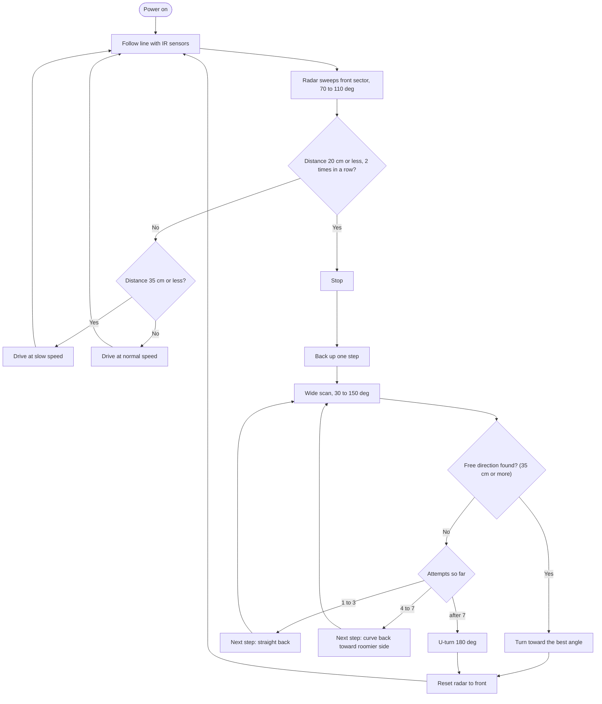

# Line Follower + Radar Obstacle Avoidance Robot

An Arduino Uno R3 robot that follows a black line using two IR sensors and avoids obstacles using an ultrasonic sensor mounted on a servo, which works like a small radar. When the path is blocked, the robot backs up, rescans, and after 3 straight attempts it backs up in a curve to get a fresh view of the space.

> **Team MHT** | Built for **Electrothon**, organized by **Enticers**, D.Y. Patil College of Engineering (DYPCOE)
>
> 🏆 **Prize winner at Electrothon**

---
## Authors
**Team MHT**

| Name | College / Branch |
|------|------------------|
| Mohit More | E&TC, DYPCOE (Team Leader) |
| Harshawardhan Talap | E&TC, DYPCOE |
| Vaibhav Shende | E&TC, DYPCOE |

Built for **Electrothon**, organized by **Enticers** at **D.Y. Patil College of Engineering (DYPCOE)**, where the project won a prize.

## Table of Contents
1. [Features](#features)
2. [Components Used](#components-used)
3. [Block Diagram](#block-diagram)
4. [Wiring](#wiring)
5. [Power Setup](#power-setup)
6. [How the Algorithm Works](#how-the-algorithm-works)
7. [Settings Reference](#settings-reference)
8. [Setup and Upload](#setup-and-upload)
9. [Calibration Steps](#calibration-steps)
10. [Serial Monitor Output](#serial-monitor-output)
11. [Troubleshooting](#troubleshooting)
12. [Known Limitations](#known-limitations)
13. [Future Improvements](#future-improvements)
14. [Project Files](#project-files)

---

## Features
- **Line following** with 2 IR sensors (line runs between the sensors)
- **Radar scanning:** the ultrasonic sensor sits on an SG90 servo and sweeps only the front sector while driving
- **Two-hit confirmation:** an obstacle must be seen twice in a row, so one wrong echo does not stop the robot
- **Slow zone:** the robot slows down as it gets close to something
- **Wide scan** (30° to 150°) only after an obstacle is detected
- **Recovery routine:** 3 straight back-steps, then curved back-steps, then a U-turn if still stuck
- **Smart direction choice:** picks the direction with the most free space and turns by the exact scanned angle
- **Body-width safety:** a direction's clearance is the smallest of its own reading and its two neighbours
- Debug output on the Serial Monitor

---

## Components Used

| # | Component | Qty | Purpose |
|---|-----------|-----|---------|
| 1 | Arduino Uno R3 | 1 | Main controller |
| 2 | DC motors with tires | 2 | Drive wheels |
| 3 | L293D motor driver (IC / module type) | 1 | Drives both motors |
| 4 | 9 V DC battery (with clip) | 2 | One powers the Arduino, one powers the motors |
| 5 | IR sensor module | 2 | Line detection |
| 6 | SG90 servo motor | 1 | Rotates the ultrasonic sensor |
| 7 | Ultrasonic sensor (HC-SR04 type) | 1 | Distance measurement |
| 8 | Chassis, caster wheel, jumper wires, switch | - | Body and connections |

> Note: this code assumes the L293D **IC / module** with `ENA`, `ENB`, `IN1` to `IN4` pins. The plug-on L293D *shield* (AFMotor library) uses different code.

---

## Block Diagram



---

## Wiring

### Pin map (Arduino Uno R3)

| Part | Part pin | Uno pin |
|------|----------|---------|
| L293D | ENA (left speed) | D5 (PWM) |
| L293D | IN1 | D2 |
| L293D | IN2 | D4 |
| L293D | ENB (right speed) | D6 (PWM) |
| L293D | IN3 | D7 |
| L293D | IN4 | D8 |
| IR left | OUT | D10 |
| IR right | OUT | D11 |
| Ultrasonic | TRIG | D12 |
| Ultrasonic | ECHO | D13 |
| SG90 servo | Signal | D9 |
| Servo, IR, ultrasonic | VCC | 5V |
| All parts | GND | GND (common) |

D0 and D1 are left free so USB upload and Serial Monitor work without disconnecting wires.

### Wiring sketch

```
                      +-----------------------+
   9V batt 1 (+) ---->| VIN         D5  ENA   |----> L293D ENA
   9V batt 1 (-) ---->| GND         D2  IN1   |----> L293D IN1
                      |             D4  IN2   |----> L293D IN2
   Servo signal  <----| D9          D6  ENB   |----> L293D ENB
   IR left OUT   ---->| D10         D7  IN3   |----> L293D IN3
   IR right OUT  ---->| D11         D8  IN4   |----> L293D IN4
   Ultra TRIG    <----| D12                   |
   Ultra ECHO    ---->| D13         5V -------|----> Servo / IR / Ultrasonic VCC
                      +-----------------------+
```

---

## Power Setup
The robot uses **two 9 V DC batteries**, so the motors and the Arduino have separate supplies:

| Battery | Connect to | Powers |
|---------|-----------|--------|
| 9 V battery 1 | Uno **VIN** pin (or barrel jack) and GND | Arduino, plus servo, IR sensors and ultrasonic sensor through the Uno 5 V pin |
| 9 V battery 2 | L293D **motor supply pin** and GND | The two DC motors |

- Connect the **Uno 5 V pin to the L293D logic supply pin** (VSS).
- **Join all grounds**: battery 1 (-), battery 2 (-), Uno GND, L293D GND, and the sensor and servo grounds. A missing common ground is the most common reason for random behaviour.
- Keeping the motors on their own battery stops motor noise and voltage dips from resetting the Uno.
- The L293D drops about 1.4 V per channel, so the motors get roughly 7.5 V when the battery is fresh. Do not set speeds too low or the motors will stall.
- If the servo twitches when the motors start, add a **470 µF capacitor** across 5V and GND near the servo.
- Add a power switch for each battery.
- 9 V batteries can only supply limited current, so the motors get weaker as the battery drains. Use **fresh batteries** before the demo.

---

## How the Algorithm Works

### Overall flow



### 1. Line following
The line runs **between** the two IR sensors.

| Left IR | Right IR | Meaning | Action |
|---------|----------|---------|--------|
| White | White | Line centred | Go straight |
| Black | White | Line drifted left | Steer left |
| White | Black | Line drifted right | Steer right |
| Black | Black | Junction or thick mark | Go straight |

### 2. Radar scan while driving
- The servo sweeps back and forth between **70° and 110°** in 10° steps.
- One distance reading is taken every **45 ms** without blocking, so line following keeps running.
- An obstacle counts only after **2 readings in a row** are 20 cm or less.
- Inside 35 cm the robot switches to slow speed.

### 3. Obstacle avoidance
1. **Stop** immediately.
2. **Back up one step**: attempts 1 to 3 go straight back (350 ms each). From attempt 4 the robot backs up in a **curve** (650 ms), with the nose swinging toward the side that had more free space in the last scan. This gives the sensor a new view.
3. **Wide scan:** the servo moves from 30° to 150° in 15° steps (9 points). Each point uses the median of 3 readings.
4. **Choose a direction:**
   - Clearance of a point = smallest of its own reading and its two neighbours
   - Score = clearance - (angle away from straight ÷ 3), so straighter paths are preferred
   - A direction is accepted only if its clearance is **35 cm or more**
5. **Turn** by the same angle the sensor was looking at, then resume line following.
6. If all **7 attempts** fail, the robot does a **180° U-turn** toward the roomier side.

### 4. Rejoining the line
After avoiding, the robot drives forward. When an IR sensor crosses the line again, line following takes over.

---

## Settings Reference
All settings are variables at the top of `robot_uno_r3.ino`.

| Variable | Default | What it does |
|----------|---------|--------------|
| `irBlackHigh` | `true` | Set `false` if the IR output is LOW on black |
| `leftMotorRev` / `rightMotorRev` | `false` | Set `true` if that motor spins the wrong way |
| `servoLeftIsHigh` | `true` | Set `false` if angles above 90° look to the right |
| `baseSpeed` | 140 | Normal driving speed (0 to 255) |
| `slowSpeed` | 100 | Speed inside the slow zone |
| `steer` | 90 | How strongly it corrects on the line |
| `turnSpeed` | 150 | Spin speed during avoidance turns |
| `backSpeed` | 130 | Straight reverse speed |
| `backFast` / `backSlow` | 150 / 60 | Wheel speeds for the curved reverse |
| `stopDist` | 20 cm | Obstacle detected |
| `slowDist` | 35 cm | Start slowing down |
| `freeDist` | 35 cm | Minimum clearance to accept a direction |
| `backStepTime` | 350 ms | One straight back step |
| `backCurveTime` | 650 ms | One curved back step |
| `msPerDeg` | 6.0 | Turn time per degree (**calibrate this**) |

---

## Setup and Upload
1. Install the **Arduino IDE** (the `Servo` library is already included).
2. Open `robot_uno_r3.ino`.
3. Select **Tools > Board > Arduino Uno** and the correct COM port.
4. Upload, then open the Serial Monitor at **115200 baud** to see debug messages.
5. Start with the robot **lifted off the ground** and check the wheels before putting it on the track.

---

## Calibration Steps
Do these in order.

1. **Motor direction:** lift the robot and call `drive(150, 150)`. Both wheels should spin forward. If one is reversed, flip `leftMotorRev` or `rightMotorRev`.
2. **IR sensors:** hold each sensor over black and white. If steering goes away from the line, flip `irBlackHigh`. Adjust the potentiometer on the IR module until black and white switch cleanly at the mounting height.
3. **Servo side:** check that the servo looks left at angles above 90°. If the robot turns toward the obstacle instead of away, flip `servoLeftIsHigh`.
4. **Distance:** place a box at 20 cm and check the Serial readings.
5. **Turn time:** run `turnDeg(90, true)` once. Increase or decrease `msPerDeg` until it turns a real 90°.
6. **Speed:** adjust `baseSpeed` and `steer` on the actual track until it follows smoothly without wobbling.

---

## Serial Monitor Output
Example while avoiding an obstacle (values will differ):

```
obstacle!
30:200  45:200  60:35  75:22  90:18  105:20  120:60  135:120  150:200
try 1  best angle 150  clear 120
```

Each `angle:distance` pair is a point of the wide scan, in degrees and centimetres.

---

## Troubleshooting

| Problem | Likely cause | Fix |
|---------|--------------|-----|
| Robot does not move | Weak or low 9 V battery, missing common GND, ENA/ENB not connected | Check power and grounds |
| Robot runs away from the line | IR polarity reversed | Flip `irBlackHigh` |
| One wheel spins backward | Motor wires swapped | Flip the motor invert flag |
| Servo twitches or Uno resets | Voltage dip when motors start | Check the motors are on battery 2, add a 470 µF capacitor |
| Stops for no reason | Echo noise or wide cone seeing the floor or walls | Tilt the sensor up slightly, increase hit count |
| Turns toward the obstacle | Servo direction flag wrong | Flip `servoLeftIsHigh` |
| Turn angle is too small or big | `msPerDeg` not calibrated | Calibrate on the floor |
| Always sees a distance of 200 | TRIG/ECHO swapped or no 5 V to sensor | Check ultrasonic wiring |
| Wobbles on the line | `steer` or `baseSpeed` too high | Lower them |

---

## Known Limitations
- **No rear sensor:** the robot backs up blind, so keep the area behind it clear.
- The ultrasonic sensor can miss soft or angled surfaces such as cloth or thin poles.
- Only two IR sensors are used, so sharp 90° corners and a lost line are handled only by the steering logic.
- Turns are time-based, not encoder-based, so accuracy depends on battery level and floor surface.
- 9 V batteries give limited current and sag as they drain, so speed and turn timing change. Use fresh batteries and recalibrate `msPerDeg` if needed.

---

## Future Improvements
- Add wheel encoders for exact turns
- Add a rear ultrasonic or IR sensor for safe reversing
- Add a third (centre) IR sensor or a 5-channel IR array for sharper turns
- PID control for smoother line following
- Bluetooth module for manual override and live debug data

---

## Project Files

| File | Description |
|------|-------------|
| `robot_uno_r3.ino` | Main Arduino Uno R3 sketch |
| `README.md` | This documentation |
